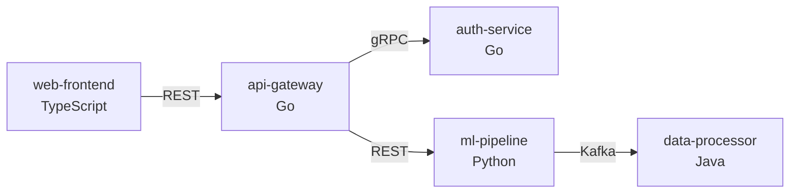

# Scope Command - Prepare Focused Analysis

Prepare a focused analysis scope for large codebases or monorepos using repomix. Creates a digestible snapshot of the target code for subsequent security analysis.

## Flags

| Flag | Effect |
|------|--------|
| `--list` | List workspaces/packages in monorepo with size estimates |
| `--compress` | Use language-aware compression (Go: 97%, TS/JS: 80%) |
| `--include` | Glob patterns to include |
| `--exclude` | Glob patterns to exclude |
| `--name` | Output filename (default: derived from path) |
| `--force` | Force scope even if >300k tokens |
| `--language` | Force specific language strategy (go\|ts\|py\|java\|rust\|php\|cs\|ruby\|sol) |

## List Workspaces (--list)

When `--list` is provided, detect and display monorepo structure:

```bash
/whitebox-pentest:scope --list
```

**Detects:**
- npm/yarn/pnpm workspaces (`package.json`, `pnpm-workspace.yaml`)
- Go modules (`go.work`, multiple `go.mod`)
- Maven/Gradle modules (`pom.xml`, `settings.gradle`)
- Rust workspaces (`Cargo.toml`)
- Python packages (`pyproject.toml`, `setup.py`)

**Output:**
```markdown
## Detected Workspaces

| Name | Path | Language | Est. Tokens | Risk |
|------|------|----------|-------------|------|
| query-service | query-service/ | Go | 184k | HIGH |
| index-service | index-service/ | Go | 100k | HIGH |
| tahoma | tahoma/ | Go | 706k | MEDIUM |

### Recommendations
- query-service: `/scope query-service --name qs`
- tahoma is oversized: scope sub-directories individually
```

## Polyglot Monorepo Detection (Automatic)

When `--list` is used, polyglot detection happens automatically. Mixed-language codebases are identified and services are mapped to their languages:

```bash
/whitebox-pentest:scope --list
```

### Step 1: Detect All Languages

```bash
echo "=== Language Distribution ==="
go_count=$(find [path] -name '*.go' ! -path '*/vendor/*' ! -name '*_test.go' 2>/dev/null | wc -l)
py_count=$(find [path] -name '*.py' ! -path '*/.venv/*' ! -name 'test_*.py' 2>/dev/null | wc -l)
ts_count=$(find [path] \( -name '*.ts' -o -name '*.tsx' \) ! -path '*/node_modules/*' ! -name '*.test.*' 2>/dev/null | wc -l)
java_count=$(find [path] -name '*.java' ! -path '*/test/*' ! -name '*Test.java' 2>/dev/null | wc -l)
rs_count=$(find [path] -name '*.rs' ! -path '*/target/*' 2>/dev/null | wc -l)
php_count=$(find [path] -name '*.php' ! -path '*/vendor/*' 2>/dev/null | wc -l)
cs_count=$(find [path] -name '*.cs' ! -path '*/bin/*' ! -path '*/obj/*' 2>/dev/null | wc -l)
rb_count=$(find [path] -name '*.rb' ! -path '*/vendor/*' 2>/dev/null | wc -l)
sol_count=$(find [path] -name '*.sol' ! -path '*/node_modules/*' 2>/dev/null | wc -l)
```

**Polyglot Detection Threshold**: If 2+ languages have >50 files each, treat as polyglot.

### Step 2: Map Services to Languages

Identify service boundaries by looking for entrypoints:

```bash
# Go services
find [path] -name 'main.go' 2>/dev/null | while read f; do dirname "$f"; done

# Python services
find [path] \( -name 'main.py' -o -name 'app.py' -o -name 'manage.py' \) 2>/dev/null | while read f; do dirname "$f"; done

# TypeScript/JavaScript services
find [path] -name 'package.json' ! -path '*/node_modules/*' -exec grep -l '"start"' {} \; 2>/dev/null | while read f; do dirname "$f"; done

# Java services
find [path] -name '*Application.java' 2>/dev/null | while read f; do dirname "$(dirname "$f")"; done

# Detect Dockerfiles for service boundaries
find [path] -name 'Dockerfile*' 2>/dev/null | while read f; do dirname "$f"; done
```

### Step 3: Detect Inter-Service Communication

```bash
# Protocol definitions
proto_count=$(find [path] -name '*.proto' 2>/dev/null | wc -l)
openapi_count=$(find [path] \( -name 'openapi*.yaml' -o -name 'swagger*.yaml' \) 2>/dev/null | wc -l)
graphql_count=$(find [path] -name '*.graphql' 2>/dev/null | wc -l)

# Message queues
kafka_refs=$(grep -rniE "kafka|rabbitmq|amqp" --include="*.yaml" --include="*.json" [path] 2>/dev/null | wc -l)
```

### Polyglot Output Format

```markdown
## Polyglot Monorepo Analysis

### Language Distribution

| Language | Files | % of Codebase |
|----------|-------|---------------|
| Go | 450 | 35% |
| Python | 380 | 30% |
| TypeScript | 420 | 33% |
| Solidity | 25 | 2% |

### Service Map

| Service | Path | Language | Est. Tokens | Risk | Communication |
|---------|------|----------|-------------|------|---------------|
| api-gateway | services/gateway/ | Go | 85k | HIGH | gRPC, REST |
| auth-service | services/auth/ | Go | 45k | CRITICAL | gRPC |
| ml-pipeline | services/ml/ | Python | 120k | HIGH | REST, Kafka |
| web-frontend | apps/web/ | TypeScript | 200k | MEDIUM | REST client |
| contracts | blockchain/contracts/ | Solidity | 15k | CRITICAL | On-chain |

### Protocol Definitions

| Type | Count | Location |
|------|-------|----------|
| Protobuf | 15 | services/proto/ |
| OpenAPI | 2 | docs/api/ |
| GraphQL | 1 | apps/web/schema/ |

### Inter-Service Data Flows



### Recommended Audit Order

| Priority | Service | Reason |
|----------|---------|--------|
| 1 | auth-service | Handles authentication, CRITICAL risk |
| 2 | api-gateway | External entry point, HIGH risk |
| 3 | contracts | Financial operations, CRITICAL risk |
| 4 | ml-pipeline | Database access, HIGH risk |
| 5 | web-frontend | Client-side only, MEDIUM risk |

### Recommended Scope Commands

```bash
# Scope each service with language-appropriate strategy
/whitebox-pentest:scope services/auth --language go --name auth
/whitebox-pentest:scope services/gateway --language go --name gateway
/whitebox-pentest:scope services/ml --language python --name ml
/whitebox-pentest:scope apps/web --language typescript --name web
/whitebox-pentest:scope blockchain/contracts --language solidity --name contracts

# Scope protocol definitions (always include)
/whitebox-pentest:scope services/proto --name protocols
```
```

### Auto-Polyglot Detection

When running `/scope --list` or `/full-audit`, polyglot detection is automatic:
- 2+ languages have >50 source files each → **Polyglot detected**
- Multiple `Dockerfile`s with different base images → **Polyglot likely**
- Multiple package managers (go.mod + package.json + requirements.txt) → **Polyglot likely**

If polyglot is detected, the output automatically includes the service map and per-service recommendations:

```
Polyglot monorepo detected: Go (450 files) + Python (380) + TypeScript (420)

## Service Map
| Service | Path | Language | Tokens | Risk |
|---------|------|----------|--------|------|
| api-gateway | services/gateway/ | Go | 85k | HIGH |
| auth-service | services/auth/ | Go | 45k | CRITICAL |
| ml-pipeline | services/ml/ | Python | 120k | HIGH |

## Recommended Scope Commands
/whitebox-pentest:scope services/auth --language go --name auth
/whitebox-pentest:scope services/ml --language python --name ml
```

To skip polyglot detection and force single-language mode:
```bash
/whitebox-pentest:scope . --language go
```

## Prerequisites

Repomix must be installed:
```bash
npm install -g repomix
# or
npx repomix --version
```

## Why Scope?

Large codebases and monorepos can overwhelm security analysis:
- Too many files to process efficiently
- Context limits with AI-assisted analysis
- Irrelevant code (tests, vendor, generated) adds noise

The `/scope` command uses repomix to create focused, token-counted snapshots.

## Execution

### Step 1: Parse Arguments

Extract from user input:
- `path`: Target directory (default: current directory)
- `--include`: Glob patterns to include (e.g., `"src/**/*.ts"`)
- `--exclude`: Glob patterns to exclude (e.g., `"**/*.test.ts"`)
- `--compress`: Use Tree-sitter to extract structure only (reduces tokens ~80%)
- `--name`: Scope name for output file (default: derived from path)

### Step 1.5: Detect Primary Language (for --compress)

If `--compress` flag is provided, detect the primary language to select optimal compression strategy:

```bash
# Count files by extension
ts_count=$(find [path] -name "*.ts" -o -name "*.tsx" 2>/dev/null | wc -l)
js_count=$(find [path] -name "*.js" -o -name "*.jsx" 2>/dev/null | wc -l)
go_count=$(find [path] -name "*.go" 2>/dev/null | wc -l)
py_count=$(find [path] -name "*.py" 2>/dev/null | wc -l)
java_count=$(find [path] -name "*.java" 2>/dev/null | wc -l)
rs_count=$(find [path] -name "*.rs" 2>/dev/null | wc -l)
```

**Language Detection Results:**
| Dominant Language | Compression Strategy |
|-------------------|---------------------|
| TypeScript/JavaScript | Tree-sitter (default repomix --compress) |
| Go | Key file filtering + go doc |
| Python | Tree-sitter (default repomix --compress) |
| Java | Interface/API file filtering |
| Rust | Tree-sitter (default repomix --compress) |

Store detected language for use in Step 4.

### Step 2: Check Repomix Installation

```bash
npx repomix --version
```

If not available, provide installation instructions.

### Step 3: Analyze Target Size

First, get an overview of what we're scoping:

```bash
# Get token count estimate
npx repomix [path] --style markdown -o /dev/null 2>&1 | grep "Total Tokens"
```

This shows the total token count for the target.

### Step 3.5: Check Token Thresholds

**Token Thresholds:**
| Size | Tokens | Action |
|------|--------|--------|
| ✅ Small | < 50k | Proceed with scope |
| ⚠️ Medium | 50k-150k | Proceed, warn about size |
| 🔶 Large | 150k-300k | Proceed with warning, suggest `--compress` |
| 🔴 Oversized | > 300k | **STOP** - Must sub-scope |

**If target exceeds 300k tokens (unless `--force` flag provided):**

1. **Show warning:**
```markdown
⚠️ **Target too large**: [path] ([N]k tokens)

This exceeds the 300k token threshold for effective analysis.
Large scopes may cause context issues and slow analysis.
```

2. **List sub-directories with sizes:**
```bash
# Get token estimates for immediate subdirectories
for dir in [path]/*/; do
  tokens=$(npx repomix "$dir" --style markdown -o /dev/null 2>&1 | grep "Total Tokens" | awk '{print $3}')
  echo "$dir: $tokens"
done
```

3. **Show sub-directory breakdown:**
```markdown
### Sub-directories available:

| Path | Est. Tokens | Risk Score |
|------|-------------|------------|
| [path]/handlers/ | ~95k | HIGH (has dangerous patterns) |
| [path]/api/ | ~120k | HIGH (external facing) |
| [path]/core/ | ~180k | MEDIUM |
| [path]/utils/ | ~40k | LOW |

### Recommended Actions:

**Option 1: Scope high-risk sub-directories individually**
\`\`\`
/whitebox-pentest:scope [path]/handlers --name [name]-handlers
/whitebox-pentest:scope [path]/api --name [name]-api
\`\`\`

**Option 2: Use compression (reduces ~80%)**
\`\`\`
/whitebox-pentest:scope [path] --compress --name [name]-structure
\`\`\`

**Option 3: Force full scope (not recommended)**
\`\`\`
/whitebox-pentest:scope [path] --force --name [name]
\`\`\`
```

4. **Risk scoring for sub-directories:**
   - Check for dangerous patterns: `grep -rniE "(exec|eval|query|serialize)" [subdir]`
   - Check for external-facing indicators: routes, handlers, controllers, api
   - HIGH = has dangerous patterns OR is external-facing
   - MEDIUM = has file/db operations
   - LOW = utilities, tests, configs

**If `--force` provided:** Proceed but add warning to output.

### Step 4: Build Repomix Command

Construct the repomix command based on arguments and detected language.

#### 4.1: Standard Commands (no --compress)

```bash
# Basic scope
npx repomix [path] --style markdown --output .claude/scope-[name].md

# With include patterns
npx repomix [path] --include "src/**/*.ts,src/**/*.js" --style markdown --output .claude/scope-[name].md

# With exclusions (always exclude these by default)
npx repomix [path] \
  --ignore "node_modules/**,vendor/**,dist/**,build/**,*.min.js,*.map,__pycache__/**,.git/**" \
  --style markdown \
  --output .claude/scope-[name].md
```

#### 4.2: Language-Specific Compression (when --compress is used)

**If TypeScript/JavaScript** (Tree-sitter works well):
```bash
npx repomix [path] --compress --style markdown \
  --ignore "node_modules/**,dist/**,build/**,*_test.*,**/*.test.*,**/*.spec.*,**/*.stories.*" \
  --output .claude/scope-[name].md
```
Expected reduction: ~80%

**If Python** (use framework-aware filtering for better results):
```bash
# Django/Flask/FastAPI - filter to architectural files
npx repomix [path] --compress --style markdown \
  --include "**/views/**/*.py,**/api/**/*.py,**/routes/**/*.py,**/endpoints/**/*.py,**/routers/**/*.py,**/models/**/*.py,**/schemas/**/*.py,**/serializers/**/*.py,**/services/**/*.py,**/handlers/**/*.py,**/middleware/**/*.py,**/auth/**/*.py,**/core/**/*.py,**/utils/**/*.py,**/__init__.py" \
  --ignore "**/*_test.py,**/test_*.py,**/tests/**,**/__pycache__/**,**/migrations/**,**/.venv/**,**/venv/**" \
  --output .claude/scope-[name].md
```
Expected reduction: **~85-90%**

**Key Python directories to include**:
- `views/`, `api/`, `routes/`, `routers/`, `endpoints/` - Entry points
- `models/` - Database models
- `schemas/`, `serializers/` - Data validation/serialization
- `services/`, `handlers/` - Business logic
- `middleware/`, `auth/` - Security-relevant
- `core/`, `utils/` - Shared utilities

**Alternative: Tree-sitter only** (simpler, less reduction):
```bash
npx repomix [path] --compress --style markdown \
  --ignore "**/*_test.py,**/test_*.py,**/tests/**,**/__pycache__/**,**/migrations/**" \
  --output .claude/scope-[name].md
```
Expected reduction: ~75%

**If Go** (Tree-sitter less effective, use directory-based filtering):
```bash
# Use directory patterns that capture architecture-relevant code
npx repomix [path] --compress --style markdown \
  --include "**/interfaces/**/*.go,**/handler/**/*.go,**/svc/**/*.go,**/proto/*.go,**/errors/*.go,**/client/*.go,**/api/**/*.go,**/types/**/*.go,**/model/**/*.go" \
  --ignore "*_test.go,**/testing/**,**/testdata/**,**/*.pb.go,**/*_mock.go" \
  --output .claude/scope-[name].md
```
Expected reduction: **~95-97%** (tested: 1.68M → 47k tokens)

**Why directory-based**: Go codebases often use descriptive filenames (index.go, store.go) rather than role-based names (interface.go, handler.go). Directory structure better captures architectural boundaries.

**Key directories to include**:
- `interfaces/` - Interface definitions
- `handler/` - Request handlers (entry points)
- `svc/` - Service implementations
- `proto/` - Protocol definitions
- `errors/` - Error types
- `client/` - Client implementations
- `api/` - API definitions
- `types/` - Type definitions
- `model/` - Data models

**If Java** (use Spring/enterprise pattern filtering):
```bash
# Spring Boot / Jakarta EE - filter to architectural files
npx repomix [path] --compress --style markdown \
  --include "**/*Controller*.java,**/*RestController*.java,**/*Service*.java,**/*ServiceImpl*.java,**/*Repository*.java,**/*Interface*.java,**/*Api*.java,**/*Endpoint*.java,**/*Handler*.java,**/*Filter*.java,**/*Interceptor*.java,**/*Config*.java,**/*Configuration*.java,**/model/**/*.java,**/dto/**/*.java,**/entity/**/*.java,**/domain/**/*.java,**/security/**/*.java,**/auth/**/*.java" \
  --ignore "**/test/**,**/tests/**,**/*Test.java,**/*Tests.java,**/*IT.java,**/target/**,**/*.class" \
  --output .claude/scope-[name].md
```
Expected reduction: **~80-85%**

**Key Java patterns to include**:
- `*Controller*`, `*RestController*`, `*Endpoint*` - Entry points
- `*Service*`, `*ServiceImpl*` - Business logic
- `*Repository*` - Data access
- `*Filter*`, `*Interceptor*` - Security filters
- `*Config*`, `*Configuration*` - Security config
- `model/`, `dto/`, `entity/`, `domain/` - Data structures
- `security/`, `auth/` - Authentication/authorization

**If Rust** (use module-based filtering for better results):
```bash
# Filter to public API and architectural files
npx repomix [path] --compress --style markdown \
  --include "**/lib.rs,**/mod.rs,**/api/**/*.rs,**/handlers/**/*.rs,**/routes/**/*.rs,**/services/**/*.rs,**/models/**/*.rs,**/schema/**/*.rs,**/auth/**/*.rs,**/middleware/**/*.rs,**/error/**/*.rs,**/types/**/*.rs,**/traits/**/*.rs,**/proto/**/*.rs" \
  --ignore "**/target/**,**/*_test.rs,**/tests/**,**/benches/**,**/examples/**" \
  --output .claude/scope-[name].md
```
Expected reduction: **~85-90%**

**Key Rust patterns to include**:
- `lib.rs`, `mod.rs` - Module definitions (public API)
- `api/`, `handlers/`, `routes/` - Entry points
- `services/` - Business logic
- `models/`, `schema/` - Data structures
- `auth/`, `middleware/` - Security-relevant
- `traits/` - Interface definitions
- `error/`, `types/` - Core types

**Alternative: Tree-sitter only** (simpler):
```bash
npx repomix [path] --compress --style markdown \
  --ignore "**/target/**,**/tests/**,**/benches/**" \
  --output .claude/scope-[name].md
```
Expected reduction: ~75%

**If PHP** (use Laravel/Symfony/WordPress pattern filtering):
```bash
# Laravel / Symfony / WordPress - filter to architectural files
npx repomix [path] --compress --style markdown \
  --include "**/app/Http/Controllers/**/*.php,**/app/Http/Middleware/**/*.php,**/app/Models/**/*.php,**/app/Services/**/*.php,**/app/Repositories/**/*.php,**/app/Policies/**/*.php,**/app/Providers/**/*.php,**/routes/**/*.php,**/src/Controller/**/*.php,**/src/Entity/**/*.php,**/src/Repository/**/*.php,**/src/Service/**/*.php,**/src/Security/**/*.php,**/includes/**/*.php,**/wp-content/plugins/**/*.php,**/wp-content/themes/**/*.php" \
  --ignore "**/vendor/**,**/node_modules/**,**/tests/**,**/test/**,**/*Test.php,**/*_test.php,**/cache/**,**/storage/**" \
  --output .claude/scope-[name].md
```
Expected reduction: **~80-85%**

**Key PHP patterns to include**:
- `Controllers/`, `Http/Controllers/` - Entry points (Laravel)
- `Controller/` - Entry points (Symfony)
- `Middleware/` - Security filters
- `Models/`, `Entity/` - Data models
- `Services/`, `Repositories/` - Business logic
- `Policies/`, `Security/` - Authorization
- `routes/` - Route definitions
- `includes/`, `wp-content/plugins/` - WordPress

**If C#/.NET** (use ASP.NET Core pattern filtering):
```bash
# ASP.NET Core / .NET - filter to architectural files
npx repomix [path] --compress --style markdown \
  --include "**/*Controller*.cs,**/*ApiController*.cs,**/Controllers/**/*.cs,**/Services/**/*.cs,**/Repositories/**/*.cs,**/Models/**/*.cs,**/Entities/**/*.cs,**/DTOs/**/*.cs,**/Middleware/**/*.cs,**/Filters/**/*.cs,**/Authorization/**/*.cs,**/Authentication/**/*.cs,**/Hubs/**/*.cs,**/*Service.cs,**/*Repository.cs,**/*Handler.cs,**/Program.cs,**/Startup.cs" \
  --ignore "**/bin/**,**/obj/**,**/test/**,**/tests/**,**/*Test*.cs,**/*Tests*.cs,**/TestResults/**,**/packages/**" \
  --output .claude/scope-[name].md
```
Expected reduction: **~80-85%**

**Key C#/.NET patterns to include**:
- `Controllers/`, `*Controller*`, `*ApiController*` - Entry points
- `Services/`, `*Service.cs` - Business logic
- `Repositories/`, `*Repository.cs` - Data access
- `Models/`, `Entities/`, `DTOs/` - Data structures
- `Middleware/`, `Filters/` - Request pipeline
- `Authorization/`, `Authentication/` - Security
- `Hubs/` - SignalR real-time
- `Program.cs`, `Startup.cs` - App configuration

**If Ruby** (use Rails pattern filtering):
```bash
# Ruby on Rails - filter to architectural files
npx repomix [path] --compress --style markdown \
  --include "**/app/controllers/**/*.rb,**/app/models/**/*.rb,**/app/services/**/*.rb,**/app/policies/**/*.rb,**/app/serializers/**/*.rb,**/app/jobs/**/*.rb,**/app/mailers/**/*.rb,**/app/channels/**/*.rb,**/config/routes.rb,**/config/initializers/**/*.rb,**/lib/**/*.rb" \
  --ignore "**/vendor/**,**/node_modules/**,**/test/**,**/spec/**,**/*_test.rb,**/*_spec.rb,**/tmp/**,**/log/**" \
  --output .claude/scope-[name].md
```
Expected reduction: **~85-90%**

**Key Ruby/Rails patterns to include**:
- `controllers/` - Entry points
- `models/` - ActiveRecord models
- `services/` - Service objects
- `policies/` - Pundit authorization
- `serializers/` - API serialization
- `jobs/`, `mailers/` - Background processing
- `channels/` - ActionCable WebSockets
- `config/routes.rb` - Route definitions
- `initializers/` - Security configuration

**If Solidity** (smart contract filtering):
```bash
# Ethereum/EVM smart contracts - filter to contract files
npx repomix [path] --compress --style markdown \
  --include "**/*.sol,**/contracts/**/*.sol,**/src/**/*.sol,**/interfaces/**/*.sol,**/libraries/**/*.sol,**/abstract/**/*.sol" \
  --ignore "**/node_modules/**,**/test/**,**/tests/**,**/*Test.sol,**/*test.sol,**/mocks/**,**/Mock*.sol,**/forge-std/**,**/lib/forge-std/**,**/lib/openzeppelin-contracts/test/**" \
  --output .claude/scope-[name].md
```
Expected reduction: **~70-80%**

**Key Solidity patterns to include**:
- `contracts/` - Main contract implementations
- `interfaces/` - Contract interfaces (external calls)
- `libraries/` - Shared library code
- `abstract/` - Base contracts
- `src/` - Foundry-style source directory

**Security-critical contract types to prioritize**:
- Token contracts (ERC20, ERC721, ERC1155)
- DeFi contracts (pools, vaults, routers, oracles)
- Governance contracts (voting, timelock)
- Proxy/upgradeable contracts
- Access control contracts

**Alternative: Include related config files**:
```bash
npx repomix [path] --compress --style markdown \
  --include "**/*.sol,**/hardhat.config.*,**/foundry.toml,**/remappings.txt" \
  --ignore "**/node_modules/**,**/test/**,**/mocks/**,**/forge-std/**" \
  --output .claude/scope-[name].md
```

#### 4.3: Manual Strategy Override

User can override auto-detection with `--strategy`:
- `--strategy tree-sitter`: Force repomix --compress (default for JS/TS/Python/Rust)
- `--strategy key-files`: Force architecture file filtering (default for Go/Java)
- `--strategy go-doc`: Force Go doc extraction only

### Step 5: Execute and Report

Run the command and parse the output summary:

```bash
npx repomix [constructed-command]
```

Repomix outputs:
- Total files packed
- Total tokens
- Top files by token count
- Security check results

### Step 6: Present Scope Summary

```markdown
## Scope Created: [name]

**Path**: [target path]
**Output**: .claude/scope-[name].md
**Mode**: [full | compressed]

### Statistics
| Metric | Value |
|--------|-------|
| Files | [N] |
| Tokens | [N] |
| Characters | [N] |

### Top Files by Size
1. [file1.ts] - [X] tokens
2. [file2.ts] - [X] tokens
3. [file3.ts] - [X] tokens

### Exclusions Applied
- node_modules/**
- vendor/**
- dist/**
- [user exclusions]

### Next Steps
- Review scope: `Read .claude/scope-[name].md`
- Run security scan: `/whitebox-pentest:scan .claude/scope-[name].md`
- Find sinks: `/whitebox-pentest:sinks --scope [name]`
- Full audit: `/whitebox-pentest:full-audit --scope [name]`
```

## Default Exclusions

These patterns are always excluded unless overridden:

```
node_modules/**
vendor/**
dist/**
build/**
.git/**
__pycache__/**
*.min.js
*.min.css
*.map
*.lock
coverage/**
.next/**
.nuxt/**
```

## Examples

### Scope a specific package in a monorepo
```
/whitebox-pentest:scope packages/api --name api
```

### Scope only source files, exclude tests
```
/whitebox-pentest:scope . --include "src/**" --exclude "**/*.test.ts,**/*.spec.ts" --name src-only
```

### Get structure-only view (compressed)
```
/whitebox-pentest:scope . --compress --name structure
```

### Scope multiple directories
```
/whitebox-pentest:scope packages/api,packages/shared --name backend
```

## Architecture Scope (Compressed)

For threat modeling and architecture analysis of large codebases, use compressed mode to create a system-wide view:

```bash
/whitebox-pentest:scope . --compress --name architecture
```

### What `--compress` Does

- Uses Tree-sitter to extract structure only (function signatures, class definitions, imports)
- Removes function bodies, keeping only the API surface
- Reduces tokens by **~80%** (e.g., 1.68M → ~336k)
- Preserves module structure and inter-component relationships

### When to Use Compressed Mode

| Use Case | Compressed? | Why |
|----------|-------------|-----|
| System-wide threat modeling | ✅ Yes | Need architecture overview, not implementation details |
| Trust boundary identification | ✅ Yes | Trust boundaries are at module interfaces |
| Component inventory | ✅ Yes | Function signatures reveal component purposes |
| Data flow diagramming | ✅ Yes | Imports and exports show data paths |
| Detailed vulnerability hunting | ❌ No | Need full code to find injection points |
| Sink searching | ❌ No | Need function bodies to find dangerous calls |
| Code review | ❌ No | Need implementation details |

### Two-Phase Workflow

Compressed scopes enable the recommended two-phase approach for large codebases:

```bash
# Phase 1: Architecture Context (run once)
/whitebox-pentest:scope . --compress --name architecture
/whitebox-pentest:threats --scope architecture --save .claude/threat-model.md

# Phase 2: Module Deep Dive (repeat per module)
/whitebox-pentest:scope impl/ --name impl
/whitebox-pentest:full-audit --scope impl
# ^ Module audit loads threat-model.md for context
```

### Compressed Scope Limitations

When using compressed mode, the following cannot be detected:
- Inline SQL queries (no function bodies)
- Hardcoded credentials (no string literals)
- Specific input validation (no implementation logic)
- Dynamic function calls (no runtime behavior)

These are caught in Phase 2 when auditing individual modules with full code.

### Example: Large Codebase Workflow

For a 1.68M token codebase:

```bash
# Step 1: Create compressed architecture scope
/whitebox-pentest:scope ~/code/my-project --compress --name project-arch
# Result: ~336k tokens (manageable)

# Step 2: Generate system threat model
/whitebox-pentest:threats --scope project-arch --save .claude/threat-model.md

# Step 3: Scope high-risk module for deep dive
/whitebox-pentest:scope ~/code/my-project/impl --name project-impl
# Result: ~159k tokens

# Step 4: Audit module with architecture context
/whitebox-pentest:full-audit --scope project-impl
# Shows relevant threats from system model
```

## Scope Management

### List existing scopes
```bash
ls -la .claude/scope-*.md
```

### Delete old scopes
```bash
rm .claude/scope-[name].md
```

### Compare scope sizes
```bash
wc -l .claude/scope-*.md
```

## Integration with Other Commands

Scopes can be referenced by other commands:

| Command | Usage |
|---------|-------|
| `/full-audit` | `/whitebox-pentest:full-audit --scope api` |
| `/scan` | `/whitebox-pentest:scan --scope api` |
| `/sinks` | `/whitebox-pentest:sinks --scope api` |
| `/threats` | `/whitebox-pentest:threats --scope api` |

When `--scope` is provided, commands will:
1. Read the scope file from `.claude/scope-[name].md`
2. Analyze the pre-processed content
3. Reference original file paths from the scope

## Notes

- Scopes are snapshots - regenerate after code changes
- Compressed scopes are great for initial architecture understanding
- Full scopes are needed for detailed vulnerability analysis
- Token counts help estimate context usage for AI analysis
- Use `--include` for focused analysis, `--exclude` for noise reduction
