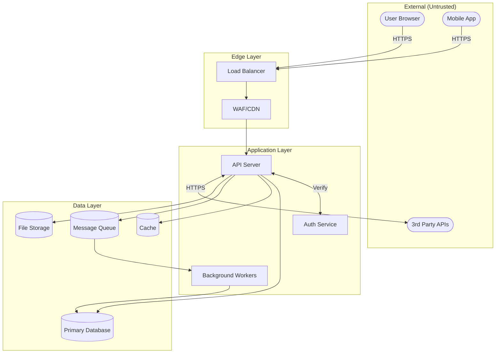
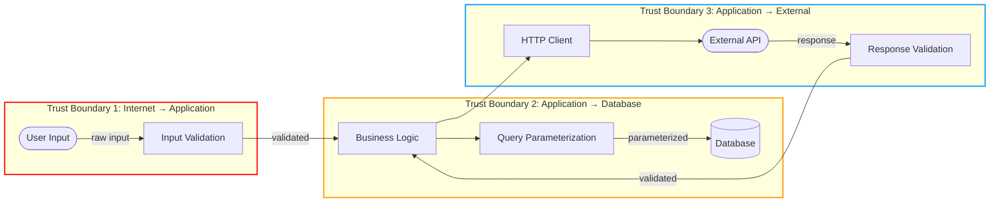
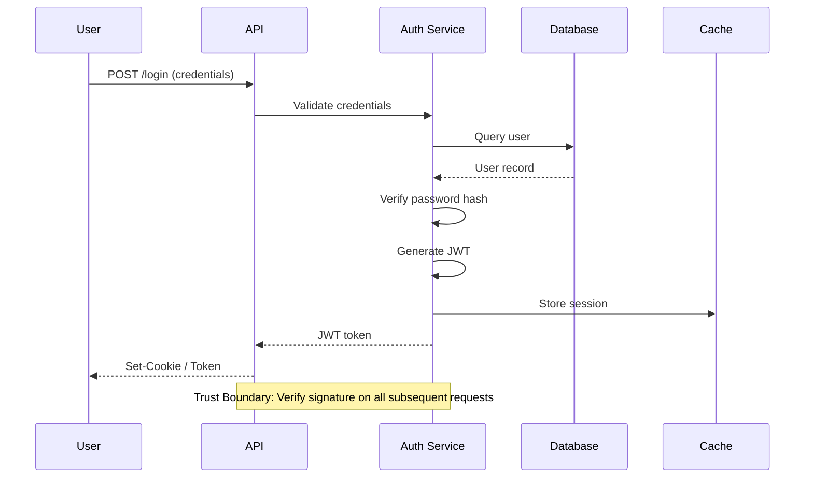

# Threat Modeling Workflow

Combines application understanding with systematic threat identification. First understands the application, then identifies what could go wrong.

## Philosophy

> "Understanding the application deeply will always beat automation." - NahamSec

Before searching for sinks, understand:
- What does this application do?
- Who are the users and what can they do?
- Where does trust exist between components?
- What workflows involve sensitive operations?

---

## Flags

| Flag | Effect |
|------|--------|
| `--quick` | Quick understanding only (skip STRIDE, faster) |
| `--diagram-only` | Only generate data flow diagrams |
| `--stride-only` | Skip understanding, go straight to STRIDE |
| `--scope name` | Use pre-created scope file |
| `--save file.md` | Save output to file |

---

## Initial Setup

1. Create a todo list to track progress
2. If `--quick` flag: do Phase 1 only (app understanding)
3. If `--diagram-only` flag: skip to Phase 2 (Data Flow Diagramming)
4. If `--stride-only` flag: skip to Phase 3 (STRIDE Analysis)

---

## Scoping Support

### Using with Compressed Scope (Large Codebases)

For large codebases (>300k tokens), run architecture-level threat modeling on a compressed scope:

```bash
# First create compressed scope
/whitebox-pentest:scope . --compress --name architecture

# Then run threats on the scope
/whitebox-pentest:threats --scope architecture --save .claude/threat-model.md
```

### If `--scope` provided:

1. Load scope file from `.claude/scope-[name].md`
2. Generate **system-level** DFDs and trust boundaries (not function-level)
3. Perform STRIDE on **components** (services, modules, data stores) not individual functions
4. Focus on:
   - Inter-module communication patterns
   - Trust boundary crossings between modules
   - External integration points
   - Data flow between major components
5. Output serves as **context for module-level audits**

### System-Level vs Function-Level Threat Modeling

| Aspect | Compressed (System-Level) | Full Code (Function-Level) |
|--------|---------------------------|---------------------------|
| Scope | Entire codebase | Single module |
| Components | Services, modules, data stores | Functions, methods, classes |
| Threats | Architecture flaws, trust issues | Implementation bugs, injection points |
| DFDs | High-level data flow | Detailed source-to-sink |
| Use case | Initial threat landscape | Deep vulnerability hunting |

### Workflow Integration

The threat model generated here is automatically loaded by `/audit` when analyzing individual modules:

```bash
# Phase 1: Create system threat model (once)
/whitebox-pentest:threats --scope architecture --save .claude/threat-model.md

# Phase 2: Module audits reference this context
/whitebox-pentest:full-audit --workspace impl
# ^ Shows relevant threats from system model for this module
```

---

## Phase 1: Technology Decomposition

### Step 1.1: Identify Entry Points

Search for all places where data enters the system:

```bash
# HTTP endpoints
grep -rniE "(app\.(get|post|put|delete|patch)|@(Get|Post|Put|Delete|Patch|RequestMapping)|router\.(get|post))" --include="*.ts" --include="*.js" --include="*.java" --include="*.py"

# WebSocket handlers
grep -rniE "(ws\.|websocket|socket\.on|@OnMessage)" --include="*.ts" --include="*.js" --include="*.java"

# File upload handlers
grep -rniE "(multer|upload|multipart|@RequestPart|FileUpload)" --include="*.ts" --include="*.js" --include="*.java" --include="*.py"

# GraphQL resolvers
grep -rniE "(resolver|@Query|@Mutation|graphql)" --include="*.ts" --include="*.js"

# Browser Event Handlers (CRITICAL - often missed!)
grep -rniE "(addEventListener\s*\(\s*['\"]message['\"]|\.onmessage\s*=)" --include="*.js" --include="*.ts" --include="*.html"

# postMessage origin validation check
grep -rniE "addEventListener\s*\(\s*['\"]message['\"]" --include="*.js" --include="*.ts" -A 10 | grep -v "origin"
```

**IMPORTANT**: Browser event handlers like `addEventListener("message", ...)` are entry points for cross-origin data! Check for missing `event.origin` validation.

Document each entry point with:
- Route/endpoint path
- HTTP method
- Parameters accepted
- Authentication required?

### Step 1.2: Identify Processing Components

Search for business logic components:

```bash
# Services/Controllers
grep -rniE "(Service|Controller|Handler|Manager|Processor)" --include="*.ts" --include="*.js" --include="*.java" --include="*.py"

# Middleware
grep -rniE "(middleware|interceptor|filter|@Before|@After)" --include="*.ts" --include="*.js" --include="*.java"

# Background workers
grep -rniE "(queue|worker|job|cron|scheduler|@Scheduled)" --include="*.ts" --include="*.js" --include="*.java" --include="*.py"
```

### Step 1.3: Identify Data Stores

Search for persistence layers:

```bash
# Database connections
grep -rniE "(mongoose|sequelize|prisma|typeorm|knex|sqlalchemy|hibernate|activerecord)" --include="*.ts" --include="*.js" --include="*.java" --include="*.py" --include="*.rb"

# Cache systems
grep -rniE "(redis|memcached|cache|@Cacheable)" --include="*.ts" --include="*.js" --include="*.java" --include="*.py"

# File storage
grep -rniE "(s3|blob|storage|FileOutputStream|writeFile)" --include="*.ts" --include="*.js" --include="*.java" --include="*.py"

# Message queues
grep -rniE "(rabbitmq|kafka|sqs|pubsub|amqp)" --include="*.ts" --include="*.js" --include="*.java" --include="*.py"
```

### Step 1.4: Identify External Dependencies

Search for third-party integrations:

```bash
# HTTP clients (external API calls)
grep -rniE "(axios|fetch|requests\.|HttpClient|RestTemplate)" --include="*.ts" --include="*.js" --include="*.java" --include="*.py"

# OAuth/SSO providers
grep -rniE "(oauth|oidc|saml|auth0|okta|cognito)" --include="*.ts" --include="*.js" --include="*.java" --include="*.py"

# Payment providers
grep -rniE "(stripe|paypal|braintree|square)" --include="*.ts" --include="*.js" --include="*.java" --include="*.py"
```

### Step 1.5: Output Component Inventory

```markdown
## Component Inventory

### Entry Points
| ID | Type | Path/Name | Auth Required | Location |
|----|------|-----------|---------------|----------|
| E-001 | REST | POST /api/login | No | routes/auth.ts:15 |
| E-002 | REST | GET /api/users/:id | Yes | routes/users.ts:42 |
| E-003 | WebSocket | /ws/notifications | Yes | ws/handler.ts:10 |
| E-004 | File Upload | POST /api/upload | Yes | routes/upload.ts:8 |
| E-005 | postMessage | window.onmessage | No (check origin!) | static/js/app.js:42 |

### Processing Components
| ID | Type | Name | Purpose | Location |
|----|------|------|---------|----------|
| P-001 | Service | AuthService | Authentication logic | services/auth.ts |
| P-002 | Middleware | AuthMiddleware | Token validation | middleware/auth.ts |
| P-003 | Worker | EmailWorker | Async email sending | workers/email.ts |

### Data Stores
| ID | Type | Name | Contains | Location |
|----|------|------|----------|----------|
| D-001 | SQL DB | PostgreSQL | User data, orders | models/*.ts |
| D-002 | Cache | Redis | Sessions, rate limits | lib/cache.ts |
| D-003 | Storage | S3 | User uploads | lib/storage.ts |

### External Dependencies
| ID | Type | Service | Data Exchanged | Location |
|----|------|---------|----------------|----------|
| X-001 | API | Stripe | Payment data | lib/payment.ts |
| X-002 | OAuth | Google | User identity | lib/oauth.ts |
```

---

## Phase 2: Data Flow Diagramming

### Step 2.1: Map Primary Data Flows

For each major user journey, trace data flow:

1. **Authentication Flow**
   - User credentials → API → Auth Service → Database → Token → User

2. **Data Retrieval Flow**
   - Request → API → Service → Database → Response

3. **File Upload Flow**
   - File → API → Validation → Storage → Database Reference

4. **External API Flow**
   - Internal Request → HTTP Client → External API → Response Processing

### Step 2.2: Generate Mermaid Diagrams

#### Application Architecture Diagram



#### Trust Boundary Diagram



#### Authentication Sequence



### Step 2.3: Mark Trust Boundaries

For each boundary, document:

| Boundary | From | To | Data Crossing | Validation Point |
|----------|------|-----|---------------|------------------|
| TB-1 | Internet | API | User input, tokens | Input validation middleware |
| TB-2 | API | Database | Queries, data | ORM/parameterized queries |
| TB-3 | API | Cache | Session data | Serialization |
| TB-4 | API | External | API requests | Response schema validation |
| TB-5 | Worker | Database | Batch data | Queue message validation |

---

## Phase 3: STRIDE Analysis

### Step 3.1: STRIDE per Component

For each component from Phase 1, analyze:

#### Entry Points (E-xxx)

| Component | S | T | R | I | D | E | Top Threat |
|-----------|---|---|---|---|---|---|------------|
| E-001 Login | JWT confusion | SQLi | No audit | Timing attack | Brute force | Priv esc | SQLi (CRITICAL) |
| E-002 Get User | Session hijack | IDOR | - | Data leak | - | Authz bypass | IDOR (HIGH) |
| E-003 WebSocket | Token theft | Msg tampering | No logging | Data exposure | Flood | - | Msg tampering (HIGH) |
| E-004 Upload | - | Path traversal | - | File disclosure | Large file | Web shell | Path traversal (CRITICAL) |

#### Processing Components (P-xxx)

| Component | S | T | R | I | D | E | Top Threat |
|-----------|---|---|---|---|---|---|------------|
| P-001 AuthService | Weak hash | Token mod | - | Secret leak | - | Role escalation | Secret leak (CRITICAL) |
| P-002 Middleware | Bypass | Header inject | - | Error leak | ReDoS | Missing check | Bypass (HIGH) |
| P-003 Worker | Job inject | Data corrupt | Missing logs | Sensitive in job | Queue flood | High privilege | Job inject (HIGH) |

#### Data Stores (D-xxx)

| Component | S | T | R | I | D | E | Top Threat |
|-----------|---|---|---|---|---|---|------------|
| D-001 Database | - | SQLi | No audit trail | Connection string | Resource exhaust | - | SQLi (CRITICAL) |
| D-002 Cache | Session hijack | Cache poison | - | Session data | Memory exhaust | ACL bypass | Cache poison (HIGH) |
| D-003 Storage | - | Overwrite | - | Direct access | Quota bypass | - | Direct access (HIGH) |

#### External Dependencies (X-xxx)

| Component | S | T | R | I | D | E | Top Threat |
|-----------|---|---|---|---|---|---|------------|
| X-001 Stripe | Webhook spoof | - | - | API key leak | - | - | API key leak (CRITICAL) |
| X-002 OAuth | State hijack | Token swap | - | Scope creep | - | Open redirect | Open redirect (HIGH) |

### Step 3.2: Detailed Threat Documentation

For each HIGH/CRITICAL threat:

```markdown
## Threat: T-001 SQL Injection in Login

**Component**: E-001 Login Endpoint
**STRIDE Category**: Tampering
**Severity**: CRITICAL
**Location**: routes/login.ts:34

### Description
User-provided email is concatenated directly into SQL query without parameterization.

### Attack Vector
```
POST /api/login
{"email": "' OR 1=1--", "password": "x"}
```

### Impact
- Authentication bypass
- Data exfiltration
- Potential RCE via SQL features

### Evidence
```typescript
// routes/login.ts:34
const user = await db.query(`SELECT * FROM users WHERE email = '${req.body.email}'`)
```

### Recommended Fix
Use parameterized queries:
```typescript
const user = await db.query('SELECT * FROM users WHERE email = $1', [req.body.email])
```

### Related
- OWASP: A03:2021 Injection
- CWE-89: SQL Injection
```

### Step 3.3: Risk Scoring

| ID | Threat | Impact (1-5) | Likelihood (1-5) | Risk Score | Priority |
|----|--------|--------------|------------------|------------|----------|
| T-001 | SQLi in Login | 5 | 5 | 25 | CRITICAL |
| T-002 | Hardcoded Secret | 5 | 4 | 20 | CRITICAL |
| T-003 | IDOR in Get User | 4 | 4 | 16 | HIGH |
| T-004 | Path Traversal Upload | 5 | 3 | 15 | HIGH |
| T-005 | Cache Poisoning | 4 | 3 | 12 | MEDIUM |

---

## Phase 4: Output Generation

### Step 4.1: Generate Threat Model Document

Compile all findings into comprehensive document.

### Step 4.2: Save to File (if --save flag provided)

If `--save filename.md` argument provided:
- Write complete threat model to specified file
- Default: `.claude/threat-model.md`

### Step 4.3: Generate Follow-Up Commands

---

---

```markdown
## Follow-Up Commands

Based on threats identified, run these commands:

### Trace Critical Threats
\`\`\`
/whitebox-pentest:trace routes/login.ts:34
\`\`\`

### Search for Similar Patterns
\`\`\`
/whitebox-pentest:propagate "string concatenation in SQL query"
\`\`\`

### Sink Search by Category
\`\`\`
/whitebox-pentest:sinks javascript
\`\`\`

### Generate Report
\`\`\`
/whitebox-pentest:report threat-findings.md
\`\`\`
```

---

## Output Template: Threat Model Document

```markdown
# Threat Model: [Application Name]

**Date**: [Generated date]
**Scope**: [What was analyzed]
**Methodology**: STRIDE

## Executive Summary

[2-3 sentences summarizing threat landscape]

**Risk Overview**:
- CRITICAL: [count]
- HIGH: [count]
- MEDIUM: [count]
- LOW: [count]

## Architecture Overview

### Data Flow Diagram

[Mermaid diagram here]

### Trust Boundaries

| ID | Boundary | Data Crossing | Protection |
|----|----------|---------------|------------|
| TB-1 | [description] | [data] | [mechanism] |

## Component Inventory

### Entry Points
[Table from Phase 1]

### Data Stores
[Table from Phase 1]

### External Dependencies
[Table from Phase 1]

## STRIDE Analysis

### Critical Threats

[Detailed threat cards for CRITICAL items]

### High Priority Threats

[Detailed threat cards for HIGH items]

### Medium/Low Threats

[Summary table]

## Risk Matrix

| ID | Threat | Component | Category | Risk | Location |
|----|--------|-----------|----------|------|----------|
| T-001 | [name] | [component] | [STRIDE] | [score] | [file:line] |

## Recommendations

### Immediate Actions (CRITICAL)
1. [Action item with specific fix]
2. [Action item with specific fix]

### Short-term (HIGH)
1. [Action item]
2. [Action item]

### Medium-term (MEDIUM)
1. [Action item]

---

## Follow-Up Commands

### Trace Threats
\`\`\`
/whitebox-pentest:trace [location]
\`\`\`

### Pattern Search
\`\`\`
/whitebox-pentest:propagate "[pattern]"
\`\`\`

### Generate Report
\`\`\`
/whitebox-pentest:report findings.md
\`\`\`

---

## Skill References

- **threat-modeling** - STRIDE methodology, component analysis
- **dangerous-functions** - Language-specific sinks
- **data-flow-tracing** - Source-to-sink analysis
- **vuln-patterns** - Exploitation techniques
```

---

## Notes

- Use `--quick` flag for faster app understanding without full STRIDE analysis
- Focus on HIGH/CRITICAL threats for immediate action
- Use Mermaid diagrams to communicate with stakeholders
- Save output with `--save` for documentation
- Threat model should be updated as codebase changes
- Each threat should link to specific code locations
- Use `/whitebox-pentest:verify` for CPG-based verification of findings

---

## Agent Integration

For complex codebases, use specialized agents for deeper analysis:

### App Mapper Agent

For comprehensive architecture mapping:

```
Use Task tool with:
  subagent_type: "whitebox-pentest:app-mapper"
  prompt: |
    Map the architecture of this codebase:
    - Path: [target_path]
    - Identify all entry points, trust boundaries, and data flows
    - Output component diagram and trust boundary analysis
```

### Threat Modeler Agent

For automated STRIDE analysis:

```
Use Task tool with:
  subagent_type: "whitebox-pentest:threat-modeler"
  prompt: |
    Perform STRIDE threat modeling on:
    - Component: [component_name]
    - Architecture: [brief description or diagram reference]
    - Focus: [specific concern or all categories]
```

These agents run autonomously and return detailed analysis to incorporate into the threat model.
