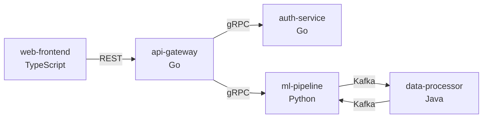
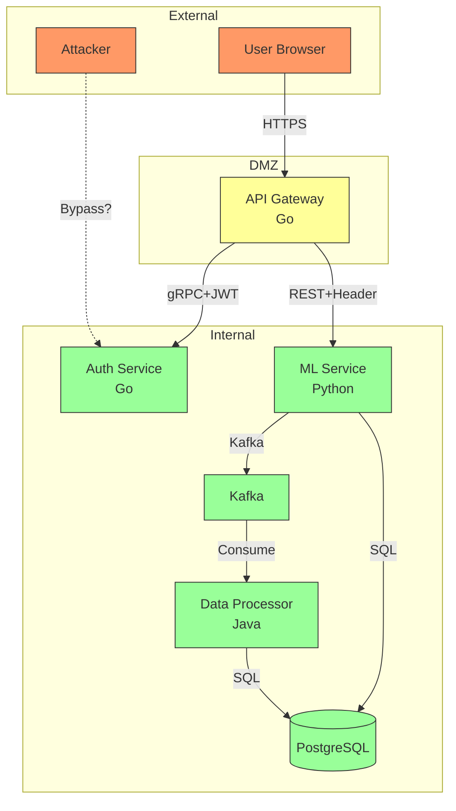

# Mixed-Language Monorepo Security Analysis

## Purpose

Provide comprehensive guidance for security analysis of polyglot codebases where multiple services are written in different programming languages. These are increasingly common in modern architectures (Go APIs + Python ML + TypeScript frontends).

## When to Use

Activate this skill when:
- Monorepo contains services in 2+ different languages
- Microservices architecture with polyglot stack
- User mentions "Go + Python", "TypeScript + Java", etc.
- Cross-service API security analysis needed
- gRPC/protobuf, OpenAPI, or GraphQL schemas present

## Core Challenges

### Why Mixed-Language is Different

| Single-Language | Mixed-Language |
|-----------------|----------------|
| One compression strategy | Per-service strategy needed |
| Unified sink database | Multiple sink databases |
| Same vulnerability patterns | Language-specific + cross-service patterns |
| Simple trust boundaries | Complex inter-service boundaries |
| One toolchain | Multiple toolchains (Semgrep rules vary) |

### Common Polyglot Patterns

| Pattern | Example | Security Concern |
|---------|---------|------------------|
| **API Gateway + Services** | Go gateway → Python/Java services | Gateway bypass, auth propagation |
| **BFF + Backend** | TS frontend → Go API → Python ML | Input validation gaps |
| **Event-Driven** | Services communicate via Kafka/RabbitMQ | Message injection, schema drift |
| **Sidecar/Service Mesh** | Envoy/Istio + any language | mTLS config, RBAC policies |

## Detection

### Step 1: Identify All Languages

```bash
# Count files by language
echo "=== Language Distribution ==="
echo "Go:         $(find . -name '*.go' ! -path '*/vendor/*' ! -name '*_test.go' 2>/dev/null | wc -l)"
echo "Python:     $(find . -name '*.py' ! -path '*/.venv/*' ! -path '*/venv/*' ! -name 'test_*.py' 2>/dev/null | wc -l)"
echo "TypeScript: $(find . \( -name '*.ts' -o -name '*.tsx' \) ! -path '*/node_modules/*' ! -name '*.test.*' ! -name '*.spec.*' 2>/dev/null | wc -l)"
echo "JavaScript: $(find . \( -name '*.js' -o -name '*.jsx' \) ! -path '*/node_modules/*' ! -name '*.test.*' ! -name '*.spec.*' 2>/dev/null | wc -l)"
echo "Java:       $(find . -name '*.java' ! -path '*/test/*' ! -name '*Test.java' 2>/dev/null | wc -l)"
echo "Rust:       $(find . -name '*.rs' ! -path '*/target/*' ! -name '*_test.rs' 2>/dev/null | wc -l)"
echo "PHP:        $(find . -name '*.php' ! -path '*/vendor/*' ! -name '*Test.php' 2>/dev/null | wc -l)"
echo "C#:         $(find . -name '*.cs' ! -path '*/bin/*' ! -path '*/obj/*' ! -name '*Test*.cs' 2>/dev/null | wc -l)"
echo "Ruby:       $(find . -name '*.rb' ! -path '*/vendor/*' ! -name '*_spec.rb' ! -name '*_test.rb' 2>/dev/null | wc -l)"
echo "Solidity:   $(find . -name '*.sol' ! -path '*/node_modules/*' ! -name '*Test.sol' 2>/dev/null | wc -l)"
```

### Step 2: Map Services to Languages

```bash
# Find service boundaries (look for entrypoints)
echo "=== Service Discovery ==="

# Go services (main.go or cmd/)
find . -name 'main.go' -o -type d -name 'cmd' 2>/dev/null | head -20

# Python services (main.py, app.py, manage.py, __main__.py)
find . \( -name 'main.py' -o -name 'app.py' -o -name 'manage.py' -o -name '__main__.py' \) 2>/dev/null | head -20

# TypeScript/JS services (package.json with "start" script)
find . -name 'package.json' ! -path '*/node_modules/*' -exec grep -l '"start"' {} \; 2>/dev/null | head -20

# Java services (Application.java, pom.xml, build.gradle)
find . \( -name '*Application.java' -o -name 'pom.xml' -o -name 'build.gradle' \) ! -path '*/test/*' 2>/dev/null | head -20

# Rust services (Cargo.toml with [[bin]])
find . -name 'Cargo.toml' -exec grep -l '\[\[bin\]\]' {} \; 2>/dev/null | head -20

# Docker/container indicators
find . -name 'Dockerfile*' -o -name 'docker-compose*.yml' -o -name 'docker-compose*.yaml' 2>/dev/null | head -20
```

### Step 3: Detect Inter-Service Communication

```bash
# Protocol definitions
echo "=== Communication Protocols ==="

# gRPC/Protobuf
find . -name '*.proto' 2>/dev/null | head -10
echo "Proto files: $(find . -name '*.proto' 2>/dev/null | wc -l)"

# OpenAPI/Swagger
find . \( -name 'openapi*.yaml' -o -name 'openapi*.yml' -o -name 'openapi*.json' -o -name 'swagger*.yaml' -o -name 'swagger*.yml' -o -name 'swagger*.json' \) 2>/dev/null | head -10

# GraphQL
find . \( -name '*.graphql' -o -name '*.gql' -o -name 'schema.graphql' \) 2>/dev/null | head -10

# Thrift
find . -name '*.thrift' 2>/dev/null | head -5

# Message queues (Kafka, RabbitMQ, etc.)
grep -rniE "(kafka|rabbitmq|amqp|pulsar|nats)" --include="*.yaml" --include="*.yml" --include="*.json" --include="*.toml" . 2>/dev/null | head -10
```

## Service Mapping Output

After detection, produce a service map:

```markdown
## Service Architecture Map

| Service | Path | Language | Entry Point | Communication |
|---------|------|----------|-------------|---------------|
| api-gateway | services/gateway/ | Go | cmd/gateway/main.go | gRPC (internal), REST (external) |
| auth-service | services/auth/ | Go | cmd/auth/main.go | gRPC |
| ml-pipeline | services/ml/ | Python | src/main.py | REST, Kafka consumer |
| web-frontend | apps/web/ | TypeScript | src/index.tsx | REST client |
| data-processor | services/processor/ | Java | src/.../Application.java | Kafka producer/consumer |

### Inter-Service Flows


```

## Per-Service Scoping Strategy

### Multi-Service Scope Command

For polyglot monorepos, scope each service with its language-appropriate strategy:

```bash
# Step 1: Scope each service with language-appropriate compression
# Go service (97% compression)
npx repomix services/gateway --compress --style markdown \
  --include "**/interfaces/**/*.go,**/handler/**/*.go,**/svc/**/*.go,**/api/**/*.go" \
  --ignore "*_test.go,**/testing/**,**/*.pb.go" \
  --output .claude/scope-gateway.md

# Python service (85-90% compression)
npx repomix services/ml --compress --style markdown \
  --include "**/api/**/*.py,**/routes/**/*.py,**/models/**/*.py,**/schemas/**/*.py,**/services/**/*.py" \
  --ignore "**/*_test.py,**/tests/**,**/__pycache__/**" \
  --output .claude/scope-ml.md

# TypeScript frontend (80% compression)
npx repomix apps/web --compress --style markdown \
  --ignore "**/node_modules/**,**/*.test.*,**/*.spec.*,**/dist/**" \
  --output .claude/scope-web.md

# Java service (80-85% compression)
npx repomix services/processor --compress --style markdown \
  --include "**/*Controller*.java,**/*Service*.java,**/*Repository*.java,**/model/**/*.java" \
  --ignore "**/test/**,**/*Test.java,**/target/**" \
  --output .claude/scope-processor.md

# Step 2: Scope shared protocol definitions (always include)
npx repomix proto/ --style markdown --output .claude/scope-proto.md
```

### Unified Architecture Scope

Create a lightweight cross-service architecture view:

```bash
# Architecture-only scope (all languages, minimal detail)
npx repomix . --compress --style markdown \
  --include "**/proto/**/*.proto,**/openapi*.yaml,**/swagger*.yaml,**/*.graphql,**/docker-compose*.yml,**/Dockerfile*,**/**/main.go,**/**/main.py,**/index.ts,**/*Application.java" \
  --ignore "**/node_modules/**,**/vendor/**,**/target/**,**/.venv/**,**/dist/**,**/build/**" \
  --output .claude/scope-architecture-overview.md
```

## Cross-Service Security Analysis

### Trust Boundaries

In polyglot monorepos, trust boundaries exist at:

| Boundary | Location | Security Concern |
|----------|----------|------------------|
| **External → Gateway** | API Gateway ingress | Input validation, rate limiting, auth |
| **Gateway → Services** | gRPC/REST internal calls | Auth token propagation, authz checks |
| **Service → Service** | Inter-service communication | Mutual TLS, service identity |
| **Service → Data Store** | Database connections | Connection string secrets, query safety |
| **Service → Queue** | Message broker | Message validation, poison message handling |
| **Service → External API** | Third-party integrations | SSRF, credential exposure |

### Cross-Service Vulnerability Patterns

#### 1. Authentication Token Propagation

**Risk**: Gateway validates JWT but downstream services trust blindly

```go
// Gateway (Go) - validates JWT
func authMiddleware(next http.Handler) http.Handler {
    return http.HandlerFunc(func(w http.ResponseWriter, r *http.Request) {
        token := r.Header.Get("Authorization")
        claims, err := validateJWT(token)  // Validated here
        // But how is identity passed to downstream services?
        ctx := context.WithValue(r.Context(), "user", claims.Subject)
        next.ServeHTTP(w, r.WithContext(ctx))
    })
}
```

```python
# ML Service (Python) - trusts X-User-ID header
@app.route('/predict')
def predict():
    user_id = request.headers.get('X-User-ID')  # VULNERABLE: Trusts header blindly
    # What if attacker bypasses gateway and calls directly?
```

**Detection**: Search for header-based identity passing:
```bash
# Go: Look for context value passing
grep -rniE "context\.WithValue.*user|X-User-ID|X-Authenticated" --include="*.go"

# Python: Look for header trust
grep -rniE "request\.headers\.get.*user|X-User-ID|X-Authenticated" --include="*.py"

# Java: Look for header trust
grep -rniE "getHeader.*[Uu]ser|X-User-ID|X-Authenticated" --include="*.java"
```

#### 2. Input Validation Gaps at Boundaries

**Risk**: Each service assumes the previous one validated

```typescript
// Frontend (TypeScript) - sends user input
const response = await fetch('/api/search', {
    method: 'POST',
    body: JSON.stringify({ query: userInput })  // Raw user input
});
```

```go
// Gateway (Go) - passes through to ML service
func searchHandler(w http.ResponseWriter, r *http.Request) {
    var req SearchRequest
    json.NewDecoder(r.Body).Decode(&req)
    // No validation - assumes ML service will handle it
    mlResponse, _ := mlClient.Search(ctx, req.Query)
}
```

```python
# ML Service (Python) - uses in SQL
def search(query: str):
    # VULNERABLE: No validation, trusts upstream
    results = db.execute(f"SELECT * FROM items WHERE name LIKE '%{query}%'")
```

**Detection**: Trace data flow across service boundaries:
```bash
# Find gRPC/REST client calls
grep -rniE "\.Call\(|\.Invoke\(|fetch\(|axios\.|requests\." --include="*.go" --include="*.py" --include="*.ts" --include="*.java"

# Find SQL execution points
grep -rniE "\.execute\(|\.query\(|\.Exec\(|\.Query\(" --include="*.go" --include="*.py" --include="*.java"
```

#### 3. Schema Mismatch Attacks

**Risk**: Proto/OpenAPI schema drift between services

```protobuf
// Proto v1 (auth-service expects)
message UserRequest {
    string user_id = 1;
    bool is_admin = 2;  // Added in v2, not validated
}
```

```python
# ML Service (Python) - older proto version
# Doesn't know about is_admin field, passes through unvalidated
```

**Detection**: Compare schema versions:
```bash
# Find all proto files and check for version comments
find . -name "*.proto" -exec grep -l "is_admin\|role\|permission" {} \;

# Check for schema version mismatches
diff <(grep "message\|field" services/auth/proto/*.proto) <(grep "message\|field" services/ml/proto/*.proto)
```

#### 4. Message Queue Injection

**Risk**: Malicious messages from compromised service

```java
// Data Processor (Java) - consumes Kafka messages
@KafkaListener(topics = "user-events")
public void processEvent(String message) {
    UserEvent event = objectMapper.readValue(message, UserEvent.class);
    // VULNERABLE: Deserialization without validation
    processUser(event.getUserId(), event.getAction());
}
```

**Detection**: Find message consumers without validation:
```bash
# Kafka consumers
grep -rniE "@KafkaListener|consume|subscribe" --include="*.java" --include="*.py" --include="*.go"

# Deserialization points
grep -rniE "objectMapper\.read|json\.loads|json\.Unmarshal|JSON\.parse" --include="*.java" --include="*.py" --include="*.go" --include="*.ts"
```

#### 5. Service-to-Service SSRF

**Risk**: Internal service URLs constructed from user input

```go
// Gateway (Go) - constructs internal URL
func proxyToService(w http.ResponseWriter, r *http.Request) {
    service := r.URL.Query().Get("service")  // User-controlled
    // VULNERABLE: Attacker can specify internal service URLs
    resp, _ := http.Get(fmt.Sprintf("http://%s.internal:8080/data", service))
}
```

**Detection**:
```bash
# Find URL construction with variables
grep -rniE "http\.Get\(.*\+|requests\.get\(.*\+|fetch\(.*\+|Sprintf.*http" --include="*.go" --include="*.py" --include="*.ts" --include="*.java"
```

## Unified Threat Model

For polyglot monorepos, the threat model must include:

### 1. Per-Language Threats

Apply language-specific dangerous functions to each service:
- Go services: Use Go sinks (exec.Command, sql.Query, etc.)
- Python services: Use Python sinks (eval, subprocess, SQLAlchemy raw)
- Java services: Use Java sinks (Runtime.exec, PreparedStatement issues)
- TypeScript: Use JS/TS sinks (eval, child_process, DOM manipulation)

### 2. Cross-Service Threats

| Threat | Description | STRIDE |
|--------|-------------|--------|
| **Auth Bypass via Direct Service Call** | Attacker bypasses gateway, calls internal service directly | Spoofing, Elevation |
| **Schema Exploitation** | Exploit proto/OpenAPI schema mismatches | Tampering |
| **Message Injection** | Inject malicious messages into queue | Tampering, Spoofing |
| **Internal SSRF** | Pivot through services to reach internal endpoints | Information Disclosure |
| **Credential Leakage** | Secrets exposed in logs across services | Information Disclosure |
| **Service Identity Spoofing** | Impersonate internal service without mTLS | Spoofing |

### 3. Data Flow Diagram (Cross-Service)



## Audit Workflow for Polyglot Repos

### Phase 0: Service Discovery
```bash
/whitebox-pentest:scope . --list --polyglot
```

Output:
```markdown
## Polyglot Monorepo Analysis

| Service | Path | Language | Tokens | Risk | Communication |
|---------|------|----------|--------|------|---------------|
| api-gateway | services/gateway/ | Go | 85k | HIGH | gRPC, REST |
| auth-service | services/auth/ | Go | 45k | CRITICAL | gRPC |
| ml-pipeline | services/ml/ | Python | 120k | HIGH | REST, Kafka |
| web-frontend | apps/web/ | TypeScript | 200k | MEDIUM | REST client |

### Protocol Definitions
- Proto files: 15 (services/proto/)
- OpenAPI specs: 2 (docs/)

### Recommended Audit Order
1. auth-service (CRITICAL - handles authentication)
2. api-gateway (HIGH - external entry point)
3. ml-pipeline (HIGH - database access, Kafka producer)
4. web-frontend (MEDIUM - client-side only)
```

### Phase 1: Per-Service Scoping
```bash
# Scope each service with language-appropriate strategy
/whitebox-pentest:scope services/auth --language go --name auth
/whitebox-pentest:scope services/gateway --language go --name gateway
/whitebox-pentest:scope services/ml --language python --name ml
/whitebox-pentest:scope apps/web --language typescript --name web

# Scope protocol definitions
/whitebox-pentest:scope services/proto --name protocols
```

### Phase 2: Cross-Service Threat Model
```bash
/whitebox-pentest:threats --polyglot --save .claude/threat-model-polyglot.md
```

### Phase 3: Per-Service Audit
```bash
# Audit each service with its language-specific sinks
/whitebox-pentest:full-audit --scope auth --language go
/whitebox-pentest:full-audit --scope ml --language python
```

### Phase 4: Cross-Service Verification
```bash
# Verify cross-service data flows
/whitebox-pentest:trace gateway:handleRequest → ml:predict
/whitebox-pentest:trace ml:publishEvent → processor:consumeEvent
```

## Integration Points

### With Existing Commands

| Command | Polyglot Enhancement |
|---------|---------------------|
| `/scope --list` | Add `--polyglot` to detect multi-language services |
| `/scope [path]` | Add `--language` to force language strategy |
| `/full-audit` | Auto-detect polyglot, audit services in priority order |
| `/threats` | Add `--polyglot` for cross-service threat model |
| `/sinks` | Use correct language sinks per service |
| `/trace` | Support cross-service traces (service:function notation) |

### With Dangerous Functions

For each service, use the appropriate language sink database:
- `dangerous-functions/references/go-sinks.md`
- `dangerous-functions/references/python-sinks.md`
- `dangerous-functions/references/javascript-sinks.md`
- `dangerous-functions/references/java-sinks.md`
- etc.

## Notes

- Service boundaries are the highest-risk areas in polyglot systems
- Always audit protocol definitions (proto, OpenAPI) as contracts
- mTLS between services is critical - verify it's enforced
- Message queues need schema validation on both producer and consumer
- Consider using service mesh (Istio/Linkerd) findings if available
