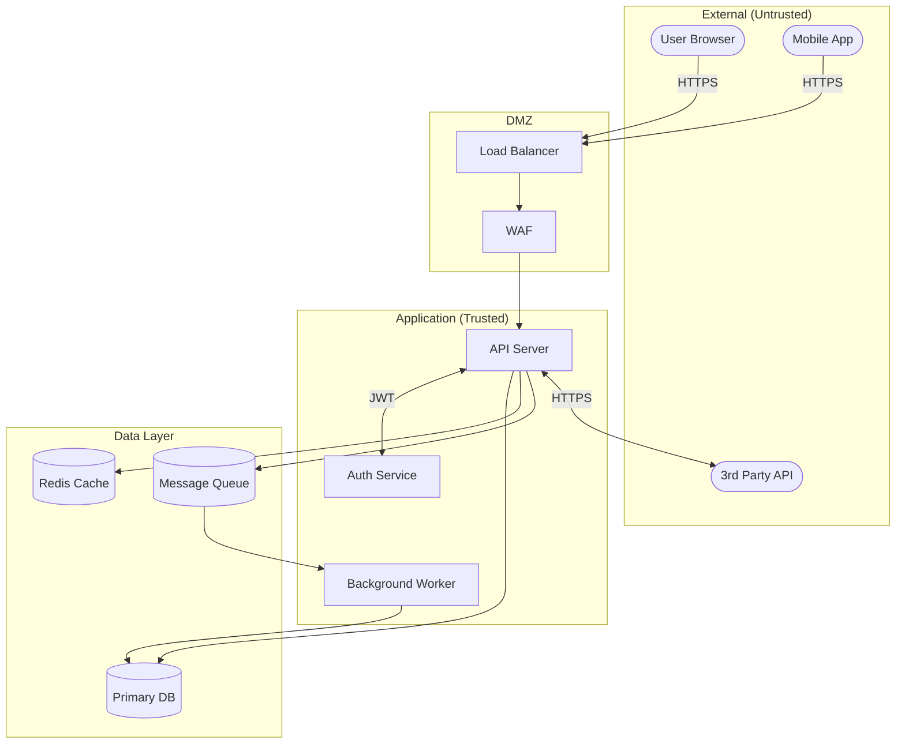
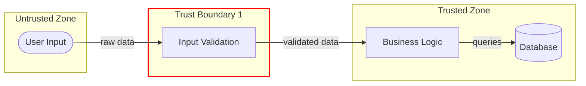
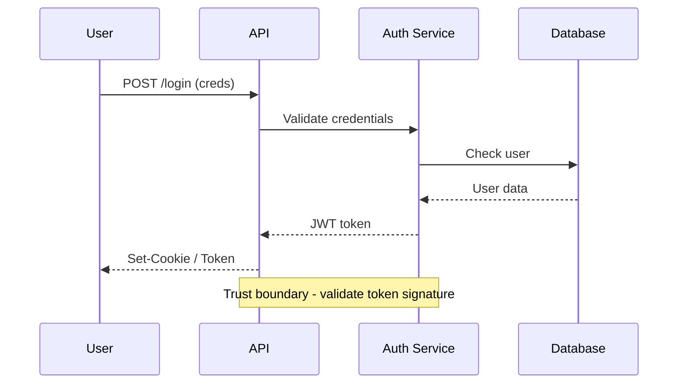

# Threat Modeling

## Purpose

Provide systematic methodology for identifying security threats through technology decomposition, data flow analysis, and STRIDE-based threat enumeration. This skill helps transform architectural understanding into actionable security findings.

**Key Insight**: Threat modeling answers "What could go wrong?" systematically. It bridges the gap between understanding an application and hunting for vulnerabilities.

---

## When to Use

Activate this skill when:
- After running `/whitebox-pentest:threats --quick` to understand the app
- Before targeted sink searching (to prioritize what to look for)
- When analyzing a new component or service
- To create visual data flow diagrams
- When systematically enumerating threats per component
- To score and prioritize security risks

---

## STRIDE Methodology

STRIDE is a threat classification framework. For each component, analyze:

| Category | Question | Example Threat |
|----------|----------|----------------|
| **S**poofing | Can identity be faked? | JWT algorithm confusion, session hijacking |
| **T**ampering | Can data be modified? | SQL injection, parameter manipulation |
| **R**epudiation | Can actions be denied? | Missing audit logs, unsigned transactions |
| **I**nformation Disclosure | Can data leak? | Error messages, log exposure, IDOR |
| **D**enial of Service | Can it be overwhelmed? | ReDoS, resource exhaustion, billion laughs |
| **E**levation of Privilege | Can access be escalated? | Broken access control, role manipulation |

---

## Threat Modeling Workflow

### Phase 1: Technology Decomposition

Break down the application into components:

```
1. Entry Points (where data enters)
   - HTTP endpoints, WebSocket, file uploads, API integrations

2. Processing Components (where data transforms)
   - Controllers, services, background jobs, validators

3. Data Stores (where data persists)
   - Databases, caches, file systems, queues

4. External Dependencies (what system trusts)
   - Third-party APIs, OAuth providers, CDN

5. Security Components (what protects)
   - Authentication, authorization, encryption, validation
```

### Phase 2: Data Flow Mapping

Trace how data moves through the system:

```
[Entry Point] → [Validation?] → [Processing] → [Storage]
                     ↓
              [Trust Boundary]
```

For each flow, document:
- What data crosses each boundary?
- Where is validation performed?
- What assumptions exist?
- Where is data encrypted/decrypted?

### Phase 3: STRIDE Analysis Per Component

For each component identified, apply STRIDE:

```markdown
## Component: Authentication Service

| Threat | Category | Risk | Location |
|--------|----------|------|----------|
| Password spraying | Spoofing | HIGH | routes/login.ts |
| JWT secret in code | Info Disclosure | CRITICAL | lib/auth.ts |
| No rate limiting | DoS | MEDIUM | middleware/auth.ts |
| Role in JWT editable | Elevation | HIGH | lib/token.ts |
```

### Phase 4: Prioritization

Score threats by:

1. **Impact** (1-5): What's the damage if exploited?
2. **Likelihood** (1-5): How easy is exploitation?
3. **Risk Score** = Impact × Likelihood

Priority order:
- CRITICAL (20-25): Immediate attention
- HIGH (15-19): Next sprint
- MEDIUM (8-14): Backlog
- LOW (1-7): Accept or defer

---

## Data Flow Diagrams (Mermaid)

### Basic Application Flow



### Trust Boundary Diagram



### Authentication Flow



---

## Component-Specific Threats

### API Endpoints

| Threat | STRIDE | Indicators |
|--------|--------|------------|
| Injection | Tampering | User input in queries/commands |
| Broken auth | Spoofing | Missing/weak authentication |
| IDOR | Info Disclosure | Direct object references |
| Mass assignment | Tampering | Full object binding |
| No rate limiting | DoS | Missing throttling |

### Authentication Components

| Threat | STRIDE | Indicators |
|--------|--------|------------|
| Credential stuffing | Spoofing | No account lockout |
| Session fixation | Spoofing | Session ID reuse |
| JWT vulnerabilities | Spoofing/Tampering | Algorithm confusion, weak secret |
| Password storage | Info Disclosure | Weak hashing (MD5, SHA1) |

### File Upload Handlers

| Threat | STRIDE | Indicators |
|--------|--------|------------|
| Path traversal | Tampering | User-controlled filename |
| XXE | Info Disclosure | XML parsing with entities |
| Unrestricted upload | Elevation | Missing type validation |
| DoS via large files | DoS | No size limits |

### Database Access

| Threat | STRIDE | Indicators |
|--------|--------|------------|
| SQL injection | Tampering | String concatenation |
| NoSQL injection | Tampering | Operator injection |
| Data exposure | Info Disclosure | Verbose errors |
| Connection exposure | Info Disclosure | Credentials in code/logs |

### External API Integrations

| Threat | STRIDE | Indicators |
|--------|--------|------------|
| SSRF | Tampering | User-controlled URLs |
| Credential exposure | Info Disclosure | API keys in code |
| Man-in-the-middle | Spoofing | No TLS verification |
| Injection via response | Tampering | Unsanitized API responses |

---

## Code Review Patterns

### Finding Components to Analyze

```bash
# Find route definitions (entry points)
grep -rniE "(app\.(get|post|put|delete)|@(Get|Post|Route)|router\.)" --include="*.ts" --include="*.js"

# Find database models (data stores)
grep -rniE "(Schema|Model|Entity|Table)" --include="*.ts" --include="*.js" --include="*.py"

# Find external API calls
grep -rniE "(fetch|axios|requests\.|http\.)" --include="*.ts" --include="*.js" --include="*.py"

# Find auth/security middleware
grep -rniE "(auth|security|jwt|session|token)" --include="*.ts" --include="*.js" --include="*.py"
```

### STRIDE-Specific Searches

```bash
# Spoofing - weak auth
grep -rniE "(algorithm|alg|HS256|none)" --include="*.ts" --include="*.js"

# Tampering - user input in dangerous ops
grep -rniE "(query|exec|eval|execute).*req\.(body|query|params)" --include="*.ts" --include="*.js"

# Info Disclosure - sensitive data exposure
grep -rniE "(password|secret|key|token).*log" --include="*.ts" --include="*.js"

# DoS - missing limits
grep -rniE "(upload|file|size|limit)" --include="*.ts" --include="*.js"

# Elevation - role/permission
grep -rniE "(role|admin|permission|isAdmin)" --include="*.ts" --include="*.js"
```

---

## Output Templates

### Threat Model Summary

```markdown
# Threat Model: [Application Name]

## Overview
[Brief description of application and scope]

## Data Flow Diagram
[Mermaid diagram here]

## Trust Boundaries
1. **Client → API**: User input validation
2. **API → Database**: Query parameterization
3. **API → External Services**: Credential protection

## STRIDE Analysis

### Critical Threats
| ID | Component | Threat | Category | Risk | Location |
|----|-----------|--------|----------|------|----------|
| T-001 | Login | SQL Injection | Tampering | CRITICAL | routes/login.ts:34 |

### High Threats
[...]

## Recommended Mitigations
[...]
```

---

## Integration with Other Skills

- Use **business-logic** for workflow and trust boundary understanding
- Use **dangerous-functions** to find sinks for identified threats
- Use **data-flow-tracing** to trace specific threat paths
- Use **vuln-patterns** for exploitation techniques
- Use **exploit-techniques** to develop PoC for confirmed threats

---

## Reference Files

For detailed threat patterns:
- **`references/stride-by-component.md`** - Common threats per component type
- **`references/common-threats-by-tech.md`** - Technology-specific threats
- **`references/data-flow-patterns.md`** - Data flow vulnerability patterns
