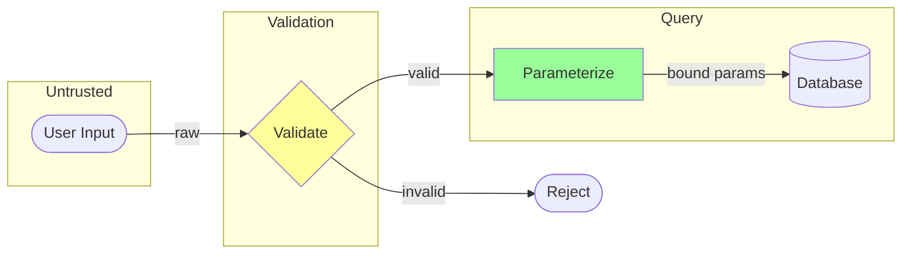
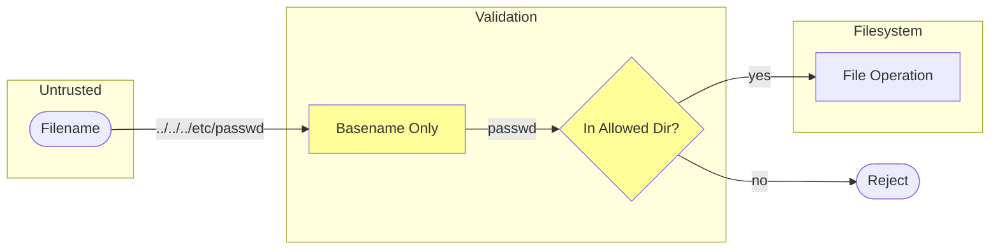
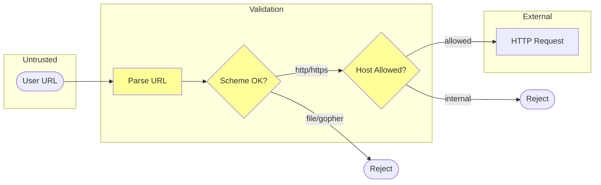
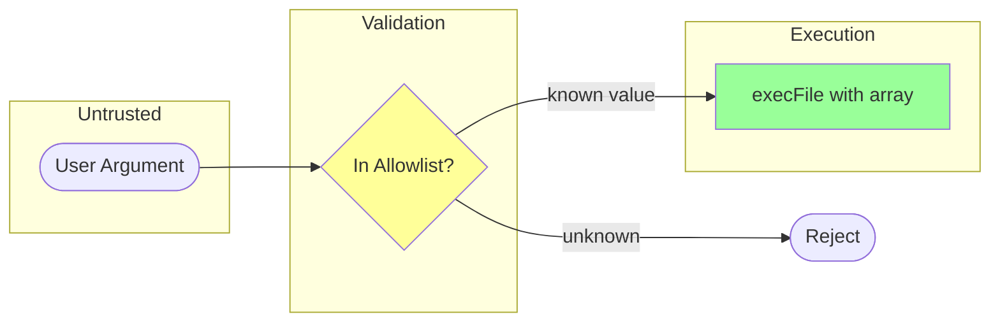
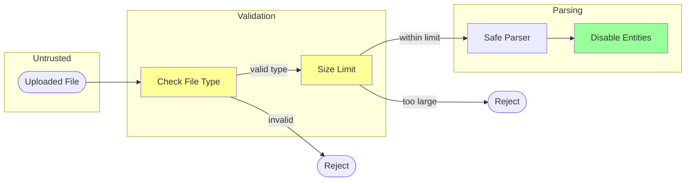
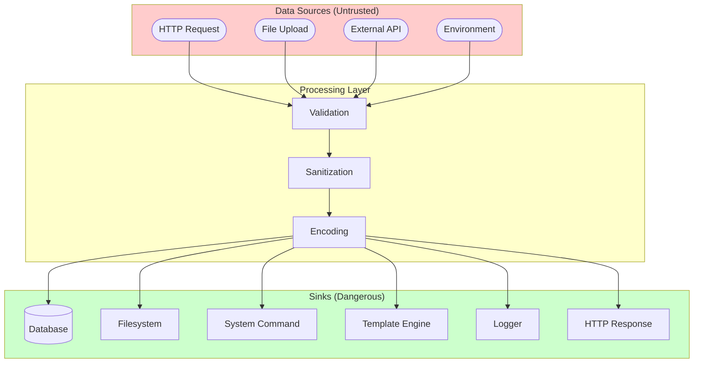
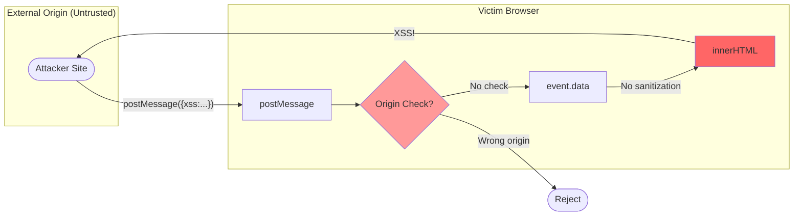
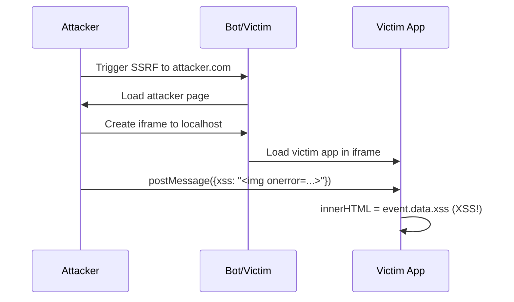

# Data Flow Vulnerability Patterns

Common vulnerability patterns based on data flow paths. Use this reference when analyzing how data moves through the application and where vulnerabilities arise.

---

## Pattern Categories

Data flow vulnerabilities occur when:
1. **Untrusted data** enters the system (SOURCE)
2. Flows through **processing** without proper sanitization
3. Reaches a **dangerous operation** (SINK)

---

## Pattern 1: User Input → Database

**Flow**: HTTP Request → Controller → Query → Database

### Vulnerable Pattern
```
User Input ──→ String Concatenation ──→ SQL Query ──→ Database
              (no sanitization)        (injection)
```

### Threats
| Threat | STRIDE | Severity |
|--------|--------|----------|
| SQL Injection | Tampering | CRITICAL |
| NoSQL Injection | Tampering | CRITICAL |
| ORM Injection | Tampering | HIGH |
| Second-order SQLi | Tampering | HIGH |

### Detection Patterns
```bash
# SQL concatenation
grep -rniE "query\(.*\+.*req\.|SELECT.*\+.*\$|WHERE.*\+.*\$"

# NoSQL operator injection
grep -rniE "find\(\{.*req\.|findOne\(\{.*\$"

# ORM raw queries
grep -rniE "\.raw\(|\.extra\(|executeQuery\("
```

### Secure Flow
```
User Input ──→ Validation ──→ Parameterized Query ──→ Database
              (whitelist)    (bound parameters)
```

### Mermaid Diagram


---

## Pattern 2: User Input → File System

**Flow**: HTTP Request → File Handler → Filesystem Operation

### Vulnerable Pattern
```
User Input ──→ Path Construction ──→ File Operation ──→ Filesystem
   (../../../)   (no validation)      (read/write)
```

### Threats
| Threat | STRIDE | Severity |
|--------|--------|----------|
| Path Traversal | Info Disclosure | HIGH |
| Arbitrary File Write | Tampering | CRITICAL |
| Arbitrary File Read | Info Disclosure | HIGH |
| File Inclusion | Elevation | CRITICAL |

### Detection Patterns
```bash
# Path operations with user input
grep -rniE "open\(.*req\.|readFile\(.*\+|writeFile\(.*\+"

# Path construction
grep -rniE "join\(.*req\.|resolve\(.*\$|Path\.Combine\(.*\+"

# File inclusion
grep -rniE "include\(.*\$|require\(.*\$|import\(.*\$"
```

### Secure Flow
```
User Input ──→ Basename Extract ──→ Allowed Directory Check ──→ File Operation
              (strip path)         (chroot equivalent)
```

### Mermaid Diagram


---

## Pattern 3: User Input → External API (SSRF)

**Flow**: HTTP Request → URL Handler → External HTTP Request

### Vulnerable Pattern
```
User Input ──→ URL Construction ──→ HTTP Client ──→ External Service
   (url param)  (no validation)     (fetch)         (internal network)
```

### Threats
| Threat | STRIDE | Severity |
|--------|--------|----------|
| SSRF to internal services | Tampering | CRITICAL |
| Cloud metadata access | Info Disclosure | CRITICAL |
| Port scanning | Info Disclosure | MEDIUM |
| Protocol smuggling | Tampering | HIGH |

### Detection Patterns
```bash
# User-controlled URLs
grep -rniE "fetch\(.*req\.|axios\.(get|post)\(.*\$|requests\.(get|post)\(.*\$"

# URL construction
grep -rniE "new URL\(.*req\.|urllib\.parse.*\$"

# HTTP client calls
grep -rniE "http\.Get\(.*\+|HttpClient.*\$"
```

### Secure Flow
```
User Input ──→ URL Parsing ──→ Allowlist Check ──→ HTTP Request
              (validate scheme)  (allowed hosts)
```

### Mermaid Diagram


---

## Pattern 4: User Input → Command Execution

**Flow**: HTTP Request → Command Builder → System Call

### Vulnerable Pattern
```
User Input ──→ String Interpolation ──→ Shell Execution
   (;rm -rf)   (no escaping)           (subprocess)
```

### Threats
| Threat | STRIDE | Severity |
|--------|--------|----------|
| Command Injection | Elevation | CRITICAL |
| Argument Injection | Elevation | HIGH |
| Environment Injection | Elevation | HIGH |

### Detection Patterns
```bash
# Command execution with user input
grep -rniE "spawn\(.*\$|popen\(.*\$"

# Shell invocation
grep -rniE "shell\s*=\s*True|/bin/(ba)?sh"

# Process creation
grep -rniE "subprocess|ProcessBuilder"
```

### Secure Flow
```
User Input ──→ Allowlist Validation ──→ Argument Array ──→ execFile (no shell)
              (known values only)      (not string)
```

### Mermaid Diagram


---

## Pattern 5: User Input → Template Engine (SSTI)

**Flow**: HTTP Request → Template Construction → Template Rendering

### Vulnerable Pattern
```
User Input ──→ Template String ──→ Template Engine ──→ HTML Output
   ({{7*7}})   (interpolated)      (evaluates code)
```

### Threats
| Threat | STRIDE | Severity |
|--------|--------|----------|
| Server-Side Template Injection | Elevation | CRITICAL |
| Information Disclosure | Info Disclosure | HIGH |
| Remote Code Execution | Elevation | CRITICAL |

### Detection Patterns
```bash
# Template with user input
grep -rniE "render_template_string|Template\(.*\$|from_string\(.*\$"

# Unsafe template rendering
grep -rniE "render.*inline:|<%=.*raw"

# Template construction
grep -rniE "jinja2\.Template\(|Mustache\.render\("
```

### Secure Flow
```
User Input ──→ Context Dictionary ──→ Predefined Template ──→ Rendered HTML
              (data only)           (static file)
```

---

## Pattern 6: Database → Output (XSS)

**Flow**: Database → Query Result → HTML Response

### Vulnerable Pattern
```
Database Content ──→ Controller ──→ HTML Template ──→ Browser
   (stored XSS)      (no encoding)   (raw output)
```

### Threats
| Threat | STRIDE | Severity |
|--------|--------|----------|
| Stored XSS | Tampering | HIGH |
| DOM XSS | Tampering | HIGH |
| HTML Injection | Tampering | MEDIUM |

### Detection Patterns
```bash
# Unsafe output (innerHTML assignment)
grep -rniE "innerHTML\s*=" --include="*.js" --include="*.ts"

# Missing encoding
grep -rniE "\.html\(.*\$|\.append\(.*\$"

# Direct DB to response
grep -rniE "res\.(send|write)\(.*query"
```

### Secure Flow
```
Database Content ──→ Output Encoding ──→ HTML Template ──→ Browser
                    (context-aware)     (auto-escaping)
```

---

## Pattern 7: File Upload → Parser (XXE/Deserialization)

**Flow**: File Upload → File Reader → Parser → Processed Data

### Vulnerable Pattern
```
Uploaded File ──→ Parser ──→ Processed Data
   (malicious)    (unsafe)   (code execution)
```

### Threats
| Threat | STRIDE | Severity |
|--------|--------|----------|
| XXE (XML External Entities) | Info Disclosure | CRITICAL |
| Unsafe Deserialization | Elevation | CRITICAL |
| YAML Bomb | DoS | HIGH |
| Zip Slip | Tampering | CRITICAL |

### Detection Patterns
```bash
# XML parsing
grep -rniE "parseXml|DocumentBuilder|SAXParser|lxml\.etree"

# Deserialization
grep -rniE "unserialize|ObjectInputStream|yaml\.load|Marshal\.load"

# Archive extraction
grep -rniE "ZipFile|unzip|tar\.extractall|ZipEntry"
```

### Secure Flow
```
Uploaded File ──→ Type Validation ──→ Safe Parser Config ──→ Processed Data
                 (magic bytes)       (entities disabled)
```

### Mermaid Diagram


---

## Pattern 8: API Response → Application Logic

**Flow**: External API → Response Handler → Application State

### Vulnerable Pattern
```
External API Response ──→ Direct Use ──→ Application Logic
   (untrusted)            (no validation)  (trusted context)
```

### Threats
| Threat | STRIDE | Severity |
|--------|--------|----------|
| Response Injection | Tampering | HIGH |
| JSONP Injection | Elevation | HIGH |
| JSON Hijacking | Info Disclosure | MEDIUM |

### Detection Patterns
```bash
# Direct API response use
grep -rniE "\.json\(\)\s*\.\s*then|await.*fetch.*\.\s*\w+"

# JSONP patterns
grep -rniE "jsonp|Function\(.*response"
```

### Secure Flow
```
External API Response ──→ Schema Validation ──→ Sanitized Data ──→ Application Logic
                        (expected structure)   (type-safe)
```

---

## Pattern 9: User Input → Logging (Log Injection)

**Flow**: HTTP Request → Logger → Log Storage

### Vulnerable Pattern
```
User Input ──→ Logger ──→ Log File
   (newlines)  (no encoding)  (forged entries)
```

### Threats
| Threat | STRIDE | Severity |
|--------|--------|----------|
| Log Injection | Tampering | MEDIUM |
| Log Forging | Repudiation | MEDIUM |
| Sensitive Data in Logs | Info Disclosure | HIGH |

### Detection Patterns
```bash
# Direct logging of user input
grep -rniE "log\.(info|debug|error)\(.*req\.|logger\..*\$|console\.log\(.*req\."

# Sensitive data logging
grep -rniE "log.*(password|token|secret|key|credit)"
```

### Secure Flow
```
User Input ──→ Sanitize (remove newlines) ──→ Logger ──→ Structured Logs
              (encode special chars)           (JSON format)
```

---

## Pattern 10: Environment/Config → Application

**Flow**: Environment Variable / Config File → Application Code

### Vulnerable Pattern
```
Environment/Config ──→ Application Code
   (secrets exposed)   (logged/leaked)
```

### Threats
| Threat | STRIDE | Severity |
|--------|--------|----------|
| Hardcoded Secrets | Info Disclosure | CRITICAL |
| Config Injection | Tampering | HIGH |
| Environment Exposure | Info Disclosure | HIGH |

### Detection Patterns
```bash
# Hardcoded secrets
grep -rniE "(password|secret|key|token)\s*=\s*['\"][^'\"]{8,}" --include="*.js" --include="*.py" --include="*.java"

# Environment in code
grep -rniE "process\.env\.|os\.environ\[|System\.getenv"

# Config file reads
grep -rniE "\.config|\.env|settings\.py|application\.properties"
```

---

## Composite Data Flow Diagram



---

## Pattern 11: postMessage Event → DOM Output (DOM XSS)

**Flow**: Cross-Origin Message → Event Handler → DOM Manipulation

### Vulnerable Pattern
```
External Origin ──→ postMessage() ──→ addEventListener("message") ──→ innerHTML
(any website)      (cross-origin)    (no origin validation)          (XSS sink)
```

### Threats
| Threat | STRIDE | Severity |
|--------|--------|----------|
| DOM XSS via postMessage | Tampering | CRITICAL |
| Cross-origin data injection | Tampering | HIGH |
| iframe-based XSS chain | Tampering | CRITICAL |

### Detection Patterns
```bash
# Find message event handlers
grep -rniE "addEventListener\s*\(\s*['\"]message['\"]" --include="*.js" --include="*.ts"

# Find handlers WITHOUT origin check (CRITICAL)
grep -rniE "addEventListener\s*\(\s*['\"]message['\"]" --include="*.js" --include="*.ts" -A 10 | grep -v "origin"

# Find event.data flowing to innerHTML
grep -rniE "event\.data.*innerHTML|innerHTML.*event\.data" --include="*.js" --include="*.ts"

# Find event.data assignments
grep -rniE "=\s*event\.data" --include="*.js" --include="*.ts"
```

### Secure Flow
```
postMessage ──→ Origin Validation ──→ Data Sanitization ──→ Safe DOM Update
               (event.origin check)   (DOMPurify/encoding)   (textContent)
```

### Mermaid Diagram


### Attack Scenario: iframe + postMessage Chain

This is commonly exploited via SSRF:
1. Attacker triggers SSRF to make bot visit attacker page
2. Attacker page loads victim app in iframe
3. Attacker sends postMessage to iframe
4. Victim's vulnerable handler executes XSS in localhost context



---

## Usage

1. Identify data entry points (sources)
2. Trace data to dangerous operations (sinks)
3. Check for missing validation/sanitization
4. Use `/whitebox-pentest:trace` for specific paths
5. Document findings in STRIDE format
6. **For browser JS**: Check postMessage handlers for origin validation
